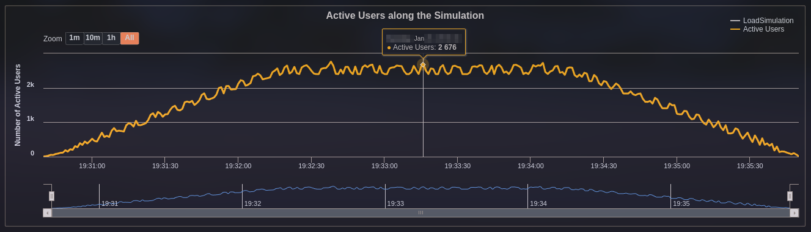
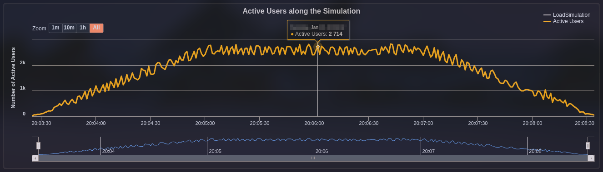
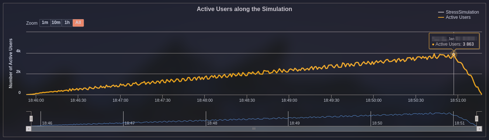
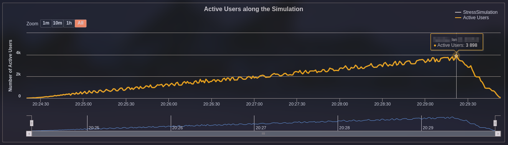
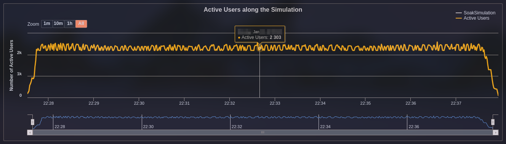
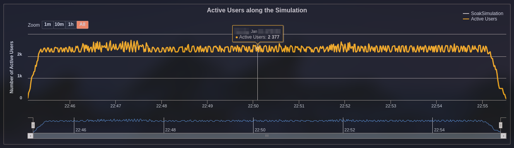
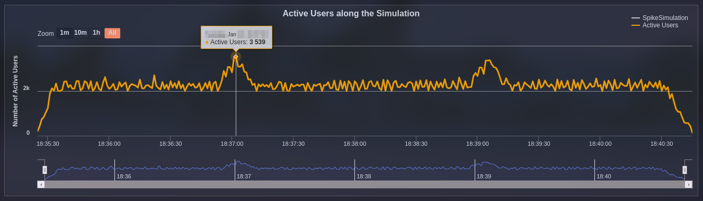
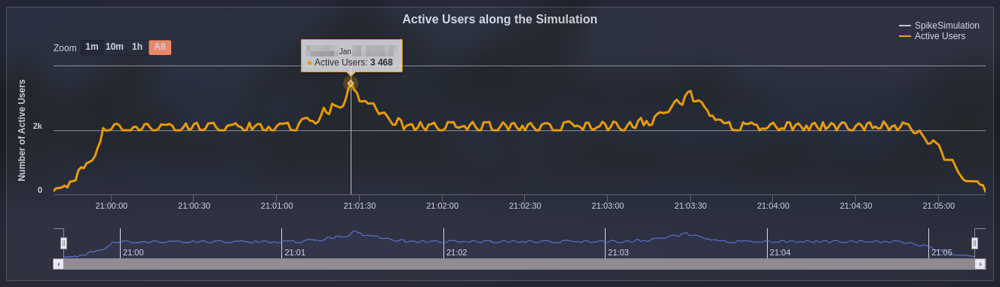

# Performance testing using Gatling with Java and Scala


This project is an example of the different types of performance tests that are described in
[Performance testing summary](https://github.com/eccanto/base-performance-testing-documentation) using Gatling and
Docker compose.

# Table of contents

* [Get started](#get-started)
  * [Requirements](#requirements)
  * [Configuration](#configuration)
  * [Run performance testing](#run-performance-testing)
    * [Implementation of "Case 1: Load testing" using Java](#implementation-of-case-1-load-testing-using-java)
    * [Implementation of "Case 1: Load testing" using Scala](#implementation-of-case-1-load-testing-using-scala)
    * [Implementation of "case 2: Stress testing" using Java](#implementation-of-case-2-stress-testing-using-java)
    * [Implementation of "case 2: Stress testing" using Scala](#implementation-of-case-2-stress-testing-using-scala)
    * [Implementation of "Case 3: Soak testing" using Java](#implementation-of-case-3-soak-testing-using-java)
    * [Implementation of "Case 3: Soak testing" using Scala](#implementation-of-case-3-soak-testing-using-scala)
    * [Implementation of "Case 4: Spike testing" using Java](#implementation-of-case-4-spike-testing-using-java)
    * [Implementation of "Case 4: Spike testing" using Scala](#implementation-of-case-4-spike-testing-using-scala)
  * [Clean environment](#crean-environment)
* [License](#license)

# Get Started

## Requirements

- [Docker +24.0.7](https://docs.docker.com/engine/install/ubuntu/)
- [Docker compose +2.21.0](https://docs.docker.com/compose/install/linux/)

## Configuration

Setup environment (start `elasticsearch`, `kibana` and `mockoon`) using docker compose:

```bash
docker compose --profile env up --detach
```

## Run performance testing

### Implementation of "Case 1: Load testing" using Java

#### Run

Set `GATLING_SIMULATION=load/java` in `.env` file:

```bash
sed -i 's/\(GATLING_SIMULATION=\).\+/\1load\/java/' .env
```

Run load testing with `10` runners:

```bash
docker compose --profile test up --scale worker=10
```

#### Result



### Implementation of "Case 1: Load testing" using Scala

#### Run

Set `GATLING_SIMULATION=load/scala` in `.env` file:

```bash
sed -i 's/\(GATLING_SIMULATION=\).\+/\1load\/scala/' .env
```

Run load testing with `10` runners:

```bash
docker compose --profile test up --scale worker=10
```

#### Result



### Implementation of "Case 2: Stress testing" using Java

#### Run

Set `GATLING_SIMULATION=stress/java` in `.env` file:

```bash
sed -i 's/\(GATLING_SIMULATION=\).\+/\1stress\/java/' .env
```

Run stress testing with `10` runners:

```bash
docker compose --profile test up --scale worker=10
```

#### Result



### Implementation of "Case 2: Stress testing" using Scala

#### Run

Set `GATLING_SIMULATION=stress/scala` in `.env` file:

```bash
sed -i 's/\(GATLING_SIMULATION=\).\+/\1stress\/scala/' .env
```

Run stress testing with `10` runners:

```bash
docker compose --profile test up --scale worker=10
```

#### Result



### Implementation of "Case 3: Soak testing" using Java

#### Run

Set `GATLING_SIMULATION=soak/java` in `.env` file:

```bash
sed -i 's/\(GATLING_SIMULATION=\).\+/\1soak\/java/' .env
```

Run soak testing with `10` runners:

```bash
docker compose --profile test up --scale worker=10
```

#### Result



### Implementation of "Case 3: Soak testing" using Scala

#### Run

Set `GATLING_SIMULATION=soak/scala` in `.env` file:

```bash
sed -i 's/\(GATLING_SIMULATION=\).\+/\1soak\/scala/' .env
```

Run soak testing with `10` runners:

```bash
docker compose --profile test up --scale worker=10
```

#### Result



### Implementation of "Case 4: Spike testing" using Java

#### Run

Set `GATLING_SIMULATION=spike/java` in `.env` file:

```bash
sed -i 's/\(GATLING_SIMULATION=\).\+/\1spike\/java/' .env
```

Run spike testing with `10` runners:

```bash
docker compose --profile test up --scale worker=10
```

#### Result



### Implementation of "Case 4: Spike testing" using Scala

#### Run

Set `GATLING_SIMULATION=spike/scala` in `.env` file:

```bash
sed -i 's/\(GATLING_SIMULATION=\).\+/\1spike\/scala/' .env
```

Run spike testing with `10` runners:

```bash
docker compose --profile test up --scale worker=10
```

#### Result



## Clean environment

```bash
docker compose --profile env --profile test down
```

# License

[MIT](./LICENSE)
