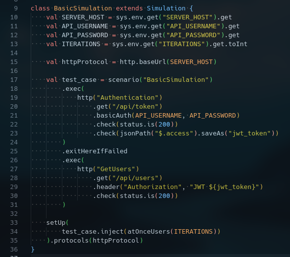
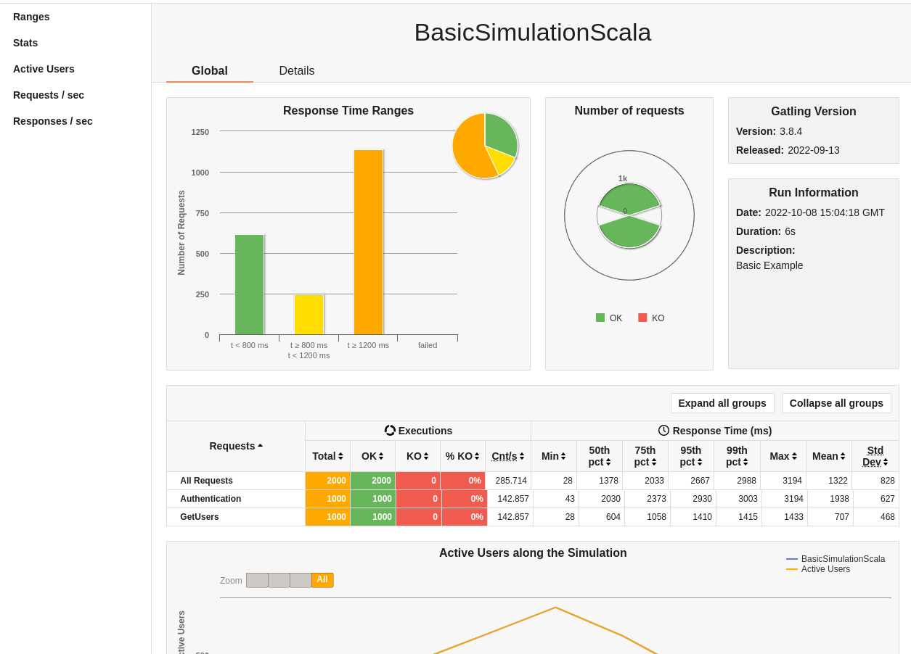

[](https://github.com/prettier/prettier)

# Load testing using Gatling

# Table of contents

* [Overview](#overview)
* [Get started](#get-started)
  * [Objetive](#objetive)
  * [Scenario](#scenario)
  * [Requirements](#requirements)
  * [Run](#run)
* [License](#license)

# Overview

[Gatling](https://github.com/gatling/gatling) is a performance testing tool used for load testing and user behavior
simulation. Load testing is the practice of testing a software application with the primary purpose of stressing the
application's capabilities.

For load testing Gatling presents test results in a offline report. One of the significant features of Gatling is its
[well-documented code source](https://gatling.io/docs/gatling/).

# Get Started

In this example, you will run a login and obtain users information using
[JSON Web Token](https://www.rfc-editor.org/rfc/rfc7519) Authentication. The tested application will be a REST API
server mock defined in this repository:
[base-mockoon-api-rest-server-mock](https://raw.githubusercontent.com/eccanto/base-mockoon-api-rest-server-mock).

## Objetive

The system will be tested with a load of `1000` requests from `10` Gatling **workers**. We'll begin by creating a
controller container and several worker containers. There are certain prerequisites that we have to perform on all
these workers. These include installing Gatling on all workers and setting up the scenario.

To achieve a consistent result, we should install the same version of Gatling on all workers, with the same
configuration on each one.

## Scenario

The following Scala code represents our load testing Gatling example:



- `line 10-12`: Gets server host and credentials.
- `line 13`: Gets the number of "iterations" by worker (defined in the [docker-compose.yml](./docker-compose.yml)).
- `line 18-24`: Log in and gets the JWT from the server.
- `line 26-31`: Task to obtain users data from the server (must be executed `1000` times).

## Requirements

- [Docker +20.10](https://docs.docker.com/engine/install/ubuntu/)
- [docker-compose +1.29](https://docs.docker.com/desktop/install/linux-install/)

## Run

The load test will execute `1000` requests from `10` gatling workers (each worker will execute `100` requests).

1. Run [REST API server mock](https://github.com/eccanto/base-mockoon-api-rest-server-mock) (address: http://localhost:3000).
2. Edit [mock_variables.env](./mock_variables.env):
    ```bash
    # CHANGE!: Change <LOCAL_IP>, this IP must be accessible from within a gatling containers.
    SERVER_HOST=http://<LOCAL_IP>:3000
    API_USERNAME=test
    API_PASSWORD=test
    ```
3. Run Gatling docker containers (with `10` workers):
    ```bash
    docker-compose up --scale worker=10
    ```
4. The Gatling report file is saved in `results/reports/index.html`.
    

# License

[MIT](./LICENSE)
