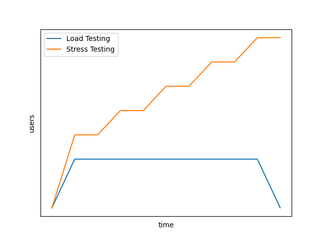

# Performance testing using Gatling (Java and Scala)

# Table of contents

* [Overview](#overview)
  * [Scenario](#scenario)
  * [System](#system)
* [Examples](#examples)
* [Appendix](#appendix)
  * [Load Testing](#load-testing)
  * [Stress Testing](#stress-testing)
    * [Stress Testing vs Load Testing](#stress-testing-vs-load-testing)
  * [Spike Testing](#spike-testing)
* [License](#license)

# Overview

[Gatling](https://github.com/gatling/gatling) is a performance testing tool used for load, stress testing and user
behavior simulation. Performance testing is the general name for tests that check how the system behaves and performs.
Software performance testing examines responsiveness, stability, scalability, reliability, speed, and resource usage
of your software and infrastructure.

For performance testing Gatling presents test results in a offline report. One of the significant features of Gatling is its
[well-documented code source](https://gatling.io/docs/gatling/).

# Scenario

In these examples, you will run a login and obtain users information using
[JSON Web Token](https://www.rfc-editor.org/rfc/rfc7519) Authentication. The tested application will be a REST API
server mock defined in this repository:
[base-mockoon-api-rest-server-mock](https://github.com/eccanto/base-mockoon-api-rest-server-mock).

## System

We'll begin by creating a controller container and several worker containers. There are certain prerequisites that we
have to perform on all these workers. These include installing Gatling on all workers and setting up the scenario
(`Java` or `Scala` file). To achieve a consistent result, we should install the same version of Gatling on all workers,
with the same configuration on each one.

# Examples

Available examples (branches):
- [Load testing using Gatling (Scala)](https://github.com/eccanto/base-gatling-performance-testing/tree/feature/load-testing-scala)
- [Load testing using Gatling (Java)](https://github.com/eccanto/base-gatling-performance-testing/tree/feature/load-testing-java)
- [Stress testing using Gatling (Scala)](https://github.com/eccanto/base-gatling-performance-testing/tree/feature/stress-testing-scala)
- [Stress testing using Gatling (Java)](https://github.com/eccanto/base-gatling-performance-testing/tree/feature/stress-testing-java)
- [Spike testing using Gatling (Scala)](https://github.com/eccanto/base-gatling-performance-testing/tree/feature/spike-testing-scala)
- [Spike testing using Gatling (Java)](https://github.com/eccanto/base-gatling-performance-testing/tree/feature/spike-testing-java)

# Appendix

## Load Testing

This type of performance testing is used to confirm that your system meets your intended performance goals or
objectives (simulates a real-world load, it is a type of `functional testing`).

## Stress Testing

It is a type of `non-functional testing`, this testing is done to find the numerical point when the system will break
(in terms of a number of the users and server requests etc.) and the related error handling for the same. During Stress
testing, the application under test is bombarded with a heavy load for a given period of time to verify the breaking
point and to see how well error handling is done.

### Stress Testing vs Load Testing

## Spike Testing

Spike testing is a type of stress testing which is performed when the application is loaded with heavy loads (within
maximum limit allowed) repeatedly and sometimes the load on the application is increased beyond the maximum limit
allowed for short duration.

# License

[MIT](./LICENSE)
